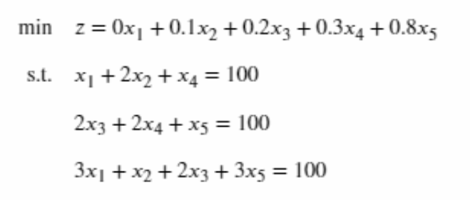

# OperationsResearchSolver
A Self-developed OR solver by Adrian Chen.

## Introduction

This is a simple OR solver with simplex method, Big-M method, branch-and-bound and cutting plane algorithms.


## Example
### Simple LP
Consider a simple linear programming problem:




Then you can solve this problem with code below:
```
def main():
    pb = Problem([0, 0.1, 0.2, 0.3, 0.8], max_problem=False)
    # 约束时保证维度一致
    pb.add_constraint([1, 2, 0, 1, 0], '=', 100)
    pb.add_constraint([0, 0, 2, 2, 1], '=', 100)
    pb.add_constraint([3, 1, 2, 0, 3], '=', 100)
    c, a, b = pb.standardization()
    pb_bigm = BigM(c, a, b)
    c, a, b, basis_index = pb_bigm.add_manual_variable()
    initialization = SimplexMethod(c, a, b, basis_index)
    x_index, x_value, z_value = initialization.solver()
    x_index += 1
    for x, value in zip(x_index, x_value):
        print('x_{} is {}'.format(x, value))
    print('The maximum value of this question is {}'.format(z_value[0]))
```

### Integer LP 
Consider a integer linear programming problem:


Then you can solve this problem with code below:
```
def main():
    pb = Problem([40, 90], max_problem=True)
    # 约束时保证维度一致
    pb.add_constraint([9, 7], '<=', 56)
    pb.add_constraint([7, 20], '<=', 70)

    # 整型规划
    integer_index = [0, 1]
    c, a, b, symbol = pb.origin()
    pb_ilp = BranchAndBound(integer_index, c, a, b, symbol)
    result = pb_ilp.solver()
    for i, j in zip(result[0], result[1]):
        print('x_{} is {}'.format(i, j))
    print('最大值为{}'.format(result[2]))
```

## Debug
1. Pivot in simplex method is based on B inverse b, not P;

2. Fix the problem that the initial basis should be a diagonal matrix rather than a random unit matrix.


## To-do-list
1. ~~Simplex method~~

2. ~~Big-M method~~

3. ~~Branch-and-bound~~

4. Cutting plane

5. ~~Solution conditions judgement~~

6. Un-constrained x

7. Add multi-constraints at same time

8. 0-1 integer programming

9. Genetic algorithm
